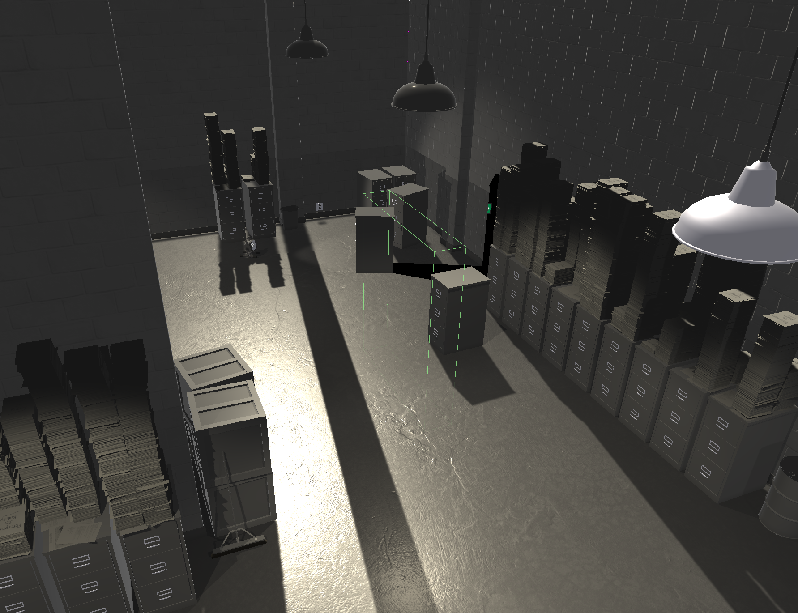

# Superliminal Checkpoint Auto-splitter and Subsplits File

Still in development. Use at your own risk. Read this file carefully before using.

## Usage

* The script is intended for PC **Glitchless** runners. Make sure you installed the correct version (2021) of the game.
* Download and select `Superliminal - subsplits.lss` as your splits file. In the settings for auto-splitter, enable "Split on checkpoints".
* For load removal in version 2020 and above, you need to set your comparison to **Game Time** instead of Real Time, which LiveSplit would read the in-game timer from memory.
* Fire up your game and have fun.
* If you need IL split files with checkpoint subsplits, you can use `IL/[level name].lss`.

## Compatibility

Only tested on LiveSplit 1.8.16 with Superliminal Steam version 1.10.2021.5.10.  The script might not work on earlier versions.

It should also work in challenge mode; I've only tested the first few rooms though. If you run challenge mode, you need to manually remove the last split for Retrospect.

## Skipping CPs

If you skip a checkpoint trigger, the script would not work properly.

* In *Induction*, the checkpoint `TC_TwoButtonRoom_EM` can be skipped if you jump down the door instead of walk down; the trigger is roughly here:
  
  

  If you have the habit to jump down the door, you can delete this checkpoint from the splits file.

* If you perform the blind walking strategy in the room where you need to jump above boxes in *Blackout* (rather than getting the red light from another room), you'll need to delete the subsplit `_ExitSignLightWithBoxes` from the splits file.

* In *Labyrinth*, after the elevator maze, there is another elevator which will teleport you to a parking lot with street lamps and moon. The checkpoint `_ParkingLot` is placed on the far end of that elevator, roughly here on the screenshot:

  

  The scene transition trigger is different from the checkpoint trigger; that is, you got the scene transition as long as you enter the elevator, while you got the checkpoint only if you hit the far end of the elevator (also, after the elevator disappeared, you can still hit the checkpoint at the middle of the parking lot area). Due to its inconsistency, this checkpoint has been removed from the split file, and **splitting on this CP is disabled** in the auto-splitter by default.

* In *Whitespace*, after you drop down from the black place with rain, there is a checkpoint here called `_WalkThroughShadow`:

  Due to its inconsistency, this checkpoint has been removed from the split file, and **splitting on this CP is disabled** in the auto-splitter by default.

No other CP skips are found in my glitchless testing runs.

## About Subsplits' Names

I use in-game CP names as subsplit names. They are fetched from game memory. They are usually about the place where the checkpoint trigger is placed, rather than the actual level between the checkpoints. Rename them as you like!